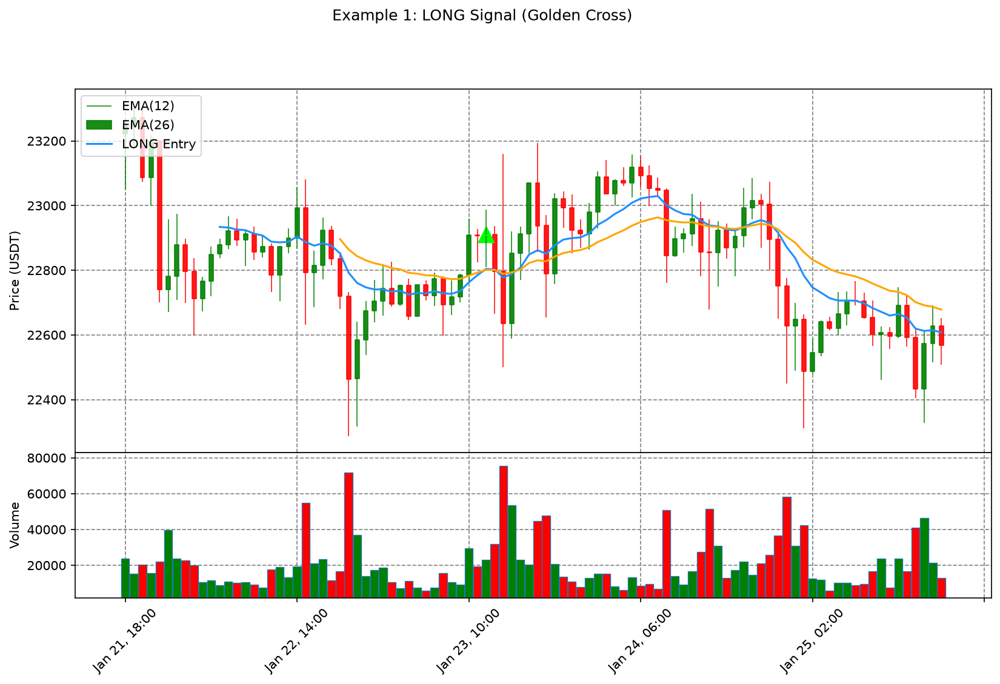
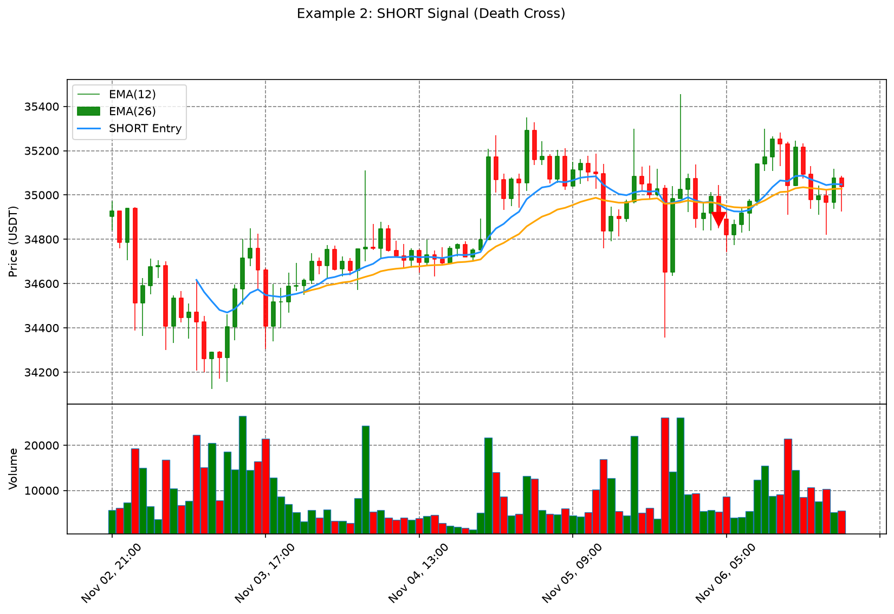
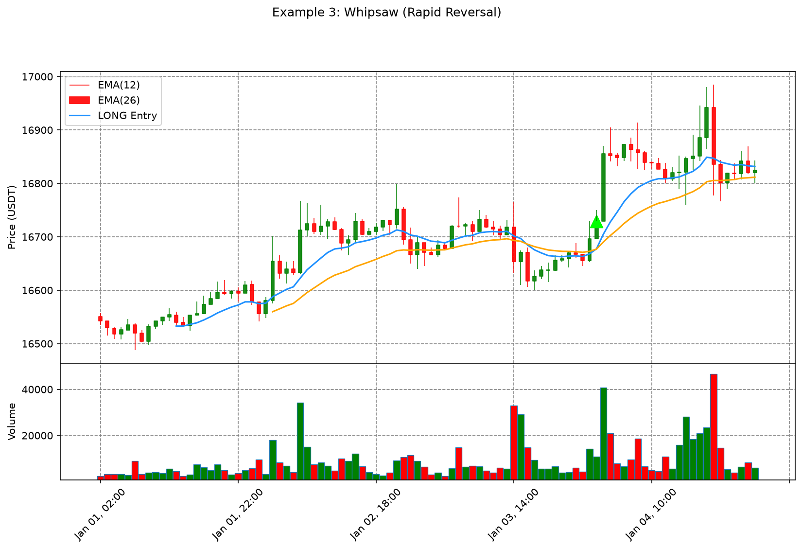

# EMA Crossover Bot

Automated trading bot using Exponential Moving Average (EMA) crossover strategy for Bybit Futures.

> **DISCLAIMER:** This is for educational and research purposes only. Trading cryptocurrencies involves high risk of total loss. The author is not responsible for any financial losses. Do not use with real money without fully understanding the risks.

---

## What is EMA?

**Exponential Moving Average (EMA)** is a type of moving average that gives more weight to recent prices, making it more responsive to new data than a Simple Moving Average (SMA).

### How EMA is Calculated

```
EMA_today = (Price_today - EMA_yesterday) x Multiplier + EMA_yesterday
Multiplier = 2 / (Period + 1)
```

The first EMA value is typically seeded with SMA of the first `Period` prices.

**Example:** EMA(12) on 1-hour candles:
- Multiplier = 2 / (12 + 1) = 0.1538
- Each new candle updates the EMA by ~15.4% of the price difference

### EMA vs SMA

| Feature | EMA | SMA |
|---------|-----|-----|
| **Responsiveness** | Fast — reacts quickly to price changes | Slow — lags behind |
| **Weighting** | Exponential — recent prices matter more | Equal — all prices weighted equally |
| **False signals** | More prone to noise | Fewer, but delayed |
| **Best for** | Short-term trading, trending markets | Long-term trends, filtering noise |

### Common EMA Periods

| Period | Use Case | Characteristics |
|--------|----------|-----------------|
| 5-10 | Scalping | Very fast, many signals, high noise |
| 12-26 | Short-term crossover | MACD uses these periods |
| 20-50 | Swing trading | Balanced speed and reliability |
| 50-200 | Long-term trend | Very slow, few but reliable signals |

### Other Moving Average Types

- **SMA (Simple Moving Average)** — equal weight to all prices in the window
- **WMA (Weighted Moving Average)** — linear weighting (recent prices weighted more)
- **DEMA (Double EMA)** — EMA of EMA, even faster response
- **TEMA (Triple EMA)** — triple smoothing for reduced lag
- **HMA (Hull Moving Average)** — weighted EMA with reduced lag

---

## Strategy: EMA Crossover

The bot uses **EMA Crossover** — one of the most fundamental trend-following strategies:

- **Golden Cross (LONG):** Fast EMA crosses above Slow EMA — bullish signal
- **Death Cross (SHORT):** Fast EMA crosses below Slow EMA — bearish signal

```
Fast EMA (12)  ─── crosses ABOVE ───→  Slow EMA (26)  =  BUY (LONG)
Fast EMA (12)  ─── crosses BELOW ───→  Slow EMA (26)  =  SELL (SHORT)
```

### Signal Examples

**LONG — Golden Cross:**


The fast EMA (blue) crosses above the slow EMA (orange), indicating the short-term trend is turning bullish. The green triangle marks the entry point.

**SHORT — Death Cross:**


The fast EMA (blue) crosses below the slow EMA (orange), indicating the short-term trend is turning bearish. The red triangle marks the entry point.

**Whipsaw — Rapid Reversal:**


A common problem with EMA crossover: the price rapidly reverses after entry, causing a loss. This is why additional filters and risk management are essential.

---

## Code Structure

### Files

| File | Description |
|------|-------------|
| `main.py` | Live trading bot for Bybit Futures |
| `bybit.py` | Bybit API v5 wrapper (GET/POST, signature, klines, orders) |
| `indicators.py` | EMA calculation (pure numpy, no dependencies) |
| `backtest.py` | Basic backtest on BTCUSDT 1h (2020-2024) |
| `backtest_baseline.py` | Baseline with SL/TP based on ATR |
| `generate_charts.py` | Chart generation script (candlesticks + EMA) |
| `improved/` | Improved version with additional filters |

### What is Implemented

**`main.py` — Live Bot:**
- EMA crossover signal detection
- Position awareness (checks current position before entry)
- Automatic position flip (close SHORT before opening LONG, and vice versa)
- Configurable EMA periods, symbol, quantity, timeframe
- Sleeps until next candle close (no idle polling)

**`bybit.py` — Exchange API:**
- Bybit v5 REST API wrapper
- HMAC signature generation
- GET requests (klines, position info)
- POST requests (market orders)
- Futures (linear) and Spot support

**`indicators.py` — EMA Calculation:**
- Pure numpy implementation (no external dependencies)
- Seeds with SMA for first value
- Exponential smoothing for subsequent values

**`backtest.py` — Basic Backtest:**
- Downloads historical data from Binance Vision
- EMA(12/26) crossover without SL/TP
- Uses `backtesting.py` library

**How positions close without SL/TP:**

In the basic backtest, positions are closed **only when a reverse signal appears**:

```python
if crossover(self.fast_ema, self.slow_ema):
    self.position.close()   # close current SHORT
    self.buy()              # open new LONG
elif crossover(self.slow_ema, self.fast_ema):
    self.position.close()   # close current LONG
    self.sell()             # open new SHORT
```

This means:
- **No stop-loss** — a losing position can stay open for weeks or months until the next crossover
- **No take-profit** — a winning position closes only when the trend reverses
- The position is always either LONG or SHORT — never flat (except between crossover and execution)

**`backtest_baseline.py` — Baseline with SL/TP:**
- Adds ATR-based stop-loss and take-profit
- Configurable SL/TP multipliers

### What is NOT Implemented

- No stop-loss in `main.py` (framework risk module handles it)
- No take-profit in `main.py` (framework risk module handles it)
- No trailing stop
- No volume or regime filters (see `improved/`)
- No Telegram notifications
- No position sizing (uses fixed quantity)

---

## Backtest Results

All backtests use **BTCUSDT 1h** from **2020-01 to 2024-09** (~41,600 candles).

### Basic (No SL/TP)

| Metric | Value |
|--------|-------|
| Return | -10.89% |
| Buy & Hold | +780.67% |
| Trades | 120 |
| Win Rate | 25% |
| Max Drawdown | -41.67% |

### Baseline (With SL/TP)

Parameters: SL = 1.5 ATR, TP = 3.0 ATR

| Metric | Value |
|--------|-------|
| Return | -22.93% |
| Trades | 50 |
| Win Rate | 28% |
| Profit Factor | 0.64 |
| Max Drawdown | -25.46% |

### Improved (With Filters)

Parameters: SL = 2.0 ATR, TP = 4.0 ATR + Volume/ATR/Regime filters

| Metric | Value |
|--------|-------|
| Return | -8.18% |
| Trades | 24 |
| Win Rate | 41.67% |
| Profit Factor | 0.70 |
| Max Drawdown | -16.28% |

### Analysis

На 1H таймфреymе чистый EMA crossover на BTC не прибылен. Основные причины:
- Ложные сигналы на боковиках — классическая проблема трендовых стратегий
- Комиссии съедают маржу при частых входах
- SL/TP снижает просадку, но не создаёт edge
- Фильтры улучшают винрейт, но уменьшают количество сделок

EMA crossover в чистом виде не даёт статистического преимущества. Для реальной торговли нужен дополнительный фильтр, определение рыночного режима или комбинация с другими индикаторами. Это baseline, с которого стоит начать эксперименты.

---

## Configurable Parameters

All parameters can be changed in the backtest files:

### Basic Parameters

| Parameter | File | Default | Description |
|-----------|------|---------|-------------|
| `SYMBOL` | all | `BTCUSDT` | Trading pair |
| `INTERVAL` | all | `1h` | Timeframe: `1m`, `5m`, `15m`, `1h`, `4h` |
| `START_DATE` | backtest | `2020-01` | Backtest start date |
| `END_DATE` | backtest | `2024-9` | Backtest end date |
| `FAST_EMA` | all | `12` | Fast EMA period |
| `SLOW_EMA` | all | `26` | Slow EMA period |
| `CASH` | backtest | `10000` | Initial capital ($) |
| `COMMISSION` | backtest | `0.002` | Commission per trade (0.2%) |

### SL/TP Parameters

| Parameter | File | Default | Description |
|-----------|------|---------|-------------|
| `ATR_PERIOD` | baseline/improved | `14` | ATR calculation period |
| `SL_ATR` | baseline/improved | `2.0` | Stop-loss = N x ATR |
| `TP_ATR` | baseline/improved | `4.0` | Take-profit = N x ATR |

### Filter Parameters (Improved Only)

| Parameter | File | Default | Description |
|-----------|------|---------|-------------|
| `VOL_MULT` | improved | `1.5` | Min volume = N x average |
| `ATR_MIN_MULT` | improved | `0.5` | Min ATR = N% of price |
| `REGIME_EMA` | improved | `50` | Regime filter EMA period |
| `COOLDOWN_BARS` | improved | `5` | Skip N bars after loss |

---

## Installation

```bash
# Clone repository
git clone https://github.com/dkalenov/trading-bots-and-strategies.git
cd trading-bots-and-strategies/EMA_bot_bybit

# Install dependencies
pip install numpy pandas requests python-dateutil backtesting matplotlib mplfinance
```

**Note:** Python 3.13 or earlier is required. `backtesting.py` and `pandas_ta` do not support Python 3.14+.

---

## Running

```bash
# Basic backtest (no SL/TP)
python backtest.py

# Baseline backtest (with SL/TP)
python backtest_baseline.py

# Improved backtest (with filters)
cd improved
python backtest_improved.py

# Generate example charts
python generate_charts.py

# Live bot (requires Bybit API keys in main.py)
python main.py
```

---

## Next Steps: Building a Production Bot

If you want to build a production bot based on this strategy:

### 1. Add Risk Management
- Implement proper position sizing (risk % per trade)
- Add trailing stop-loss
- Implement maximum drawdown limit

### 2. Add Filters
- Volume confirmation (only trade on high volume)
- Volatility filter (ATR minimum)
- Trend regime filter (EMA50/EMA200)
- Time-of-day filter (avoid low-liquidity hours)

### 3. Optimize Parameters
- Test different EMA periods (9/21, 10/30, 15/50)
- Optimize SL/TP ratios
- Test on multiple symbols
- Walk-forward optimization

### 4. Add Infrastructure
- Telegram notifications
- Database logging (PostgreSQL)
- Health monitoring
- Graceful shutdown

### 5. Consider Using Algofactory Framework
The parent repository includes `algofactory_bot/` — a production-ready framework with:
- ATR-based position sizing
- 2 take-profit levels with breakeven stop
- Trailing stop
- Exchange gateway (Binance)
- Database persistence
- Telegram integration

See `algofactory_bot/strategies/` for adapter examples.

---

## Contacts

- Telegram: [@KDR_98](https://t.me/KDR_98)
- LinkedIn: [dmitrii-kalenov](https://www.linkedin.com/in/dmitrii-kalenov)
- Email: drkalenov@gmail.com
